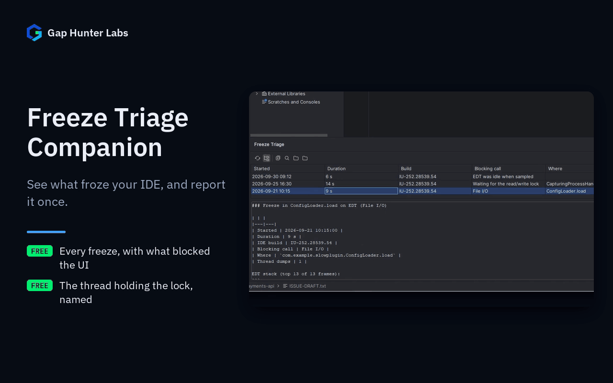

# Freeze Triage Companion

Lists every UI freeze your IDE recorded, with what blocked the UI and where, and turns each one into a report ready
for an issue, after a search for tickets that already describe it.



Each feature on its own:
[Every freeze, classified](docs/media/01-freeze-history.gif) ·
[Lock waits explained](docs/media/02-lock-holder.gif) ·
[A report, ready to paste](docs/media/03-copy-report.gif)

## Why it exists

When the UI freezes for more than a few seconds, the IDE writes thread dumps to its log folder
(`threadDumps-freeze-<date>-<build>`). What happens next is mostly manual:

- **Performance Diagnostics**, bundled with the IDE, names a plugin when a freeze is attributed to one ("Plugin 'X'
  might be slowing things down"). Freezes in the platform itself get no such hint.
- **Analyze Stacktrace or Thread Dump** classifies one dump at a time, after you find the file and paste its text.
- Nothing lists past freezes, or tells you whether a ticket for the same method already exists.

The public tracker shows the cost. By this project's own count of freeze tickets filed in IJPL and IDEA since
January 2025 (as of October 2026), most tickets filed by users carry no stack trace, and they get fixed about half
as often as the tickets that carry one. One of the most voted freeze tickets,
[IJPL-74471](https://youtrack.jetbrains.com/issue/IJPL-74471), is a long thread of separate dumps sorted by hand
into other tickets.

## What it does

The **Freeze Triage** tool window (also under **Help | Diagnostic Tools | Freeze Triage**) lists the freezes newest
first, with start time, duration, IDE build, the blocking call and where it happened. For the selected freeze:

- **Blocking call**: what the frozen thread was doing, from the first meaningful frame on top of its stack: file
  I/O, an external process, a network call, `runBlocking`, waiting for another thread, class loading, an index
  lookup, a VFS refresh, reference resolution, service initialization, and more.
- **Lock waits**: when the EDT waits for the read/write lock, it names the thread holding the lock and what that
  thread was doing. A thread still waiting for the lock is not mistaken for the holder.
- **Plugins**: when a plugin you installed is in the blocking stack, it is named, with its version and vendor.
- **Copy Report**: a Markdown report with a title in the form JetBrains uses for freeze tickets, the duration, the
  build, the classification and the trimmed stacks.
- **Search YouTrack**: opens a YouTrack search for the method where the freeze happened, fixed tickets included, so
  you can vote on or comment an existing ticket instead of filing a duplicate.
- **Open Thread Dump** and **Show Folder** for the raw files.

Freezes recorded by other installed versions of the same IDE (for example 2025.2 and 2026.2) are listed too; a
toolbar toggle turns that off.

## Why built this way

- **Reads what the IDE already writes.** No agent, no sampling of its own: the thread dumps in the log folder are the
  source, so the plugin adds no overhead while you work.
- **Off the EDT.** Listing folders, reading dumps and indexing plugins run in a background task you can cancel. Opening
  a dump looks the file up on a pooled thread.
- **Public API only.** In current IDE versions, the API that lists installed plugins and maps a class to its plugin is
  internal. The plugin reads the `plugin.xml` and the package names of the jars in your plugins folder instead, and
  keeps only the packages that appear in the frozen stacks.
- **Classification checked against real stacks.** The frame patterns come from public freeze tickets, and the tests
  run the classifier over 393 real stacks from those tickets.

## Stated honestly: scope

- The classification is a heuristic: the first frame on top of the stack that matches a known blocking call. When
  nothing matches, the freeze is reported as computation. It names the call, not the root cause.
- A dump that caught the EDT waiting for the next event (a modal dialog, or a freeze that ended before the dump) is
  shown as **EDT idle when sampled**: that dump cannot say what blocked the UI.
- A freeze folder without dumps (the IDE was closed or killed while frozen) is listed without a classification.
- Only plugins you installed are named. Code from the platform and from bundled plugins is reported as the IDE.
- Up to 5 dumps per freeze are read. The most frequent result among them is shown.
- The YouTrack search matches the method name only. Similar tickets may use another method of the same stack.

## Privacy

Everything stays on your machine. The plugin reads the IDE's log folder and the jars in your plugins folder, and sends
nothing anywhere. The YouTrack search opens in your browser only when you click it, with the method name as the query.
The report contains stack frames, the IDE build and the name of the thread holding the lock; no file paths or project
names. See [PRIVACY.md](PRIVACY.md).

## Enterprise / Team Licensing

Need enterprise features, custom rules, or team licensing? Contact us at
**gaphunterlabs@gmail.com**.

## Development

```
./gradlew test           # unit tests
./gradlew buildPlugin    # generates build/distributions/*.zip
./gradlew verifyPlugin   # checks compatibility against real IDEs
```

## License

Apache-2.0. See `LICENSE`.
